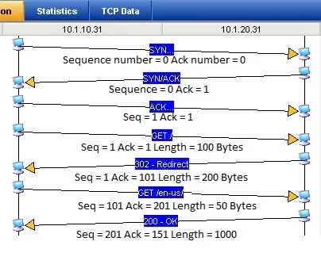
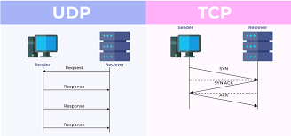

# Here we will go to upper layer which is Network Layer which is Layer three
- Network Layer is responsible for routing and addressing , It is the layer where the IP addresses are used

### Switch only understand MAC address that makes LIN but what if I want to connect different LIN
- So we need to convert MAC to IP address
- IP address is a 32 bit number that is divided into 4 octets, Each octet is separated by a dot
- IP address is used to identify a device on a network and to route packets between devices on a network.

### What is Routing ?
- Routing is the process of forwarding packets between devices on a network
- Routing is done by the Network Layer based on the IP address of the destination device

## evp protocol
- EVp is a protocol that is used for communication between the CAN bus and the IP network
- EVp is used to convert CAN bus messages to IP packets and vice versa.

### What is time synicing 
- Time synchronizing is the process of synchronizing the time on multiple devices on a network
- Time synchronizing is important for many applications such as data logging and control systems.
- Time synchronizing is typically done using a protocol such as NTP (Network Time Protocol)
- NTP is a protocol that is used to synchronize the time on multiple devices on a network.
- NTP uses a hierarchical structure to synchronize the time on devices on a network.
- The root server is the top of the hierarchy and is synchronized with an external time source.

# PTP protocol precision type protocol which is used to sync between nodes and this used over Ethernet
- PTP is a protocol that is used for time synchronizing on a network
- PTP is used to synchronize the time on devices on a network with an accuracy of nanoseconds

------------------------------------------------------------------------------------------------
* So If SRC = IP and DEST = IP, How SRC call DEST without MAC Address
- This is where the Network Layer comes in
### ARP frame
- ARP is a protocol that is used to resolve IP addresses to MAC addresses
- ARP is used to find the MAC address of a device on a network based on its IP address
- ARP is typically used when a device needs to send a packet to a device on the same network
- ARP is used to resolve IP addresses to MAC addresses on a network

------------------------------------------------------------------------------------------------
# Layer four which is Transport Layer
- Transport Layer is responsible for providing reliable data transfer between devices on a network
- Transport Layer is responsible for breaking up data into packets and reassembling them at the receiving end
- Transport Layer is also responsible for error checking and correction

### Before this Layer our farme consist of 
- So we have Ethernet, Frame Layer, Network Layer and Transport Layer
- At the end of Transport Layer we know what protocol will be used in Layer three
- This protocol is TCP or UDP

* UDP --> For communication between two applications
- UDP is a connectionless protocol and best-effort protocol
- UDP does not guarantee delivery of packets or order of packets
- UDP is typically used for applications that do not require guaranteed delivery or order of packets

### What is the meaning of connectionless protocol
- Connectionless protocol is a protocol that does not establish a connection between devices before sending data
- Connectionless protocol is typically used for applications that do not require guaranteed delivery or order of packets
- Connectionless protocol is typically used for applications such as DNS, DHCP, and TFTP

- UDP Header --> Source Port, Destination Port, Length, Checksum.
- UDP is a simple protocol and does not have many fields

* Source Port
- Source Port is the port number of the device that is sending the packet
* Port Numbers
- Port numbers are used to identify the application or service that is running on a device
- Port numbers are typically in the range of 0 to 65535
- Well-known port numbers are used for common applications such as HTTP (80), FTP (21),and SSH (22)
- Dynamic port numbers are used for applications that do not require a specific port number

### DHCP 
* If I have 16 available IP and we have 30 ECU in the car but we know that no more than 16 ECU will be available at a time, How will we handle it
- This is where DHCP comes in and used to dynamically assign IP addresses to devices on a network so it automatically assign IP addresses to devices on a network and assign IP addresses to devices
- DHCP is also used to manage IP addresses on a network and to prevent IP address conflicts

* So DHCP is a protocol that is used to dynamically assign IP addresses to devices on a network
- DHCP is used to automatically assign IP addresses to devices on a network and assign IP addresses to devices on a network for a specific period of time

- So Server here would be an ECU but has DHCP application
- Client here would be an ECU but has DHCP application
- DHCP Server would be the one that is responsible for assigning IP addresses to devices on a network
- DHCP Client would be the one that is requesting an IP address from the DHCP Server
- DHCP Lease would be the period of time that the IP address is assigned to the device
### DHCP should be over UDP becuase it requires both of them to have IP

------------------------------------------------------------------------------------------------
* TCP protocol
- TCP is a connection-oriented protocol and guarantees delivery of packets and order of packets
- TCP is typically used for applications that require guaranteed delivery and order of packets
- TCP is typically used for applications such as HTTP, FTP, and SSH
- TCP is a reliable protocol and ensures that data is delivered in the correct order
 
 - How TCP works 
 - TCP establishes a connection between devices before sending data
 - TCP uses a three-way handshake to establish a connection
 - TCP uses a sequence number to ensure that data is delivered in the correct order
 - TCP uses an acknowledgement number to ensure that data is delivered correctly
 - TCP uses a window size to control the amount of data that is sent at one time
 - TCP uses a timeout to determine when a packet has not been delivered
 

* Three way handshake connection
- SYN (synchronize) packet is sent from the client to the server
- SYN-ACK (synchronize-acknowledgement) packet is sent from the server to the
- ACK (acknowledgement) packet is sent from the client to the server

- Sync flag
What is Sync flag
- The SYN flag is used to establish a connection between devices, synchronize the sequence numbers of the devices, and initiate the three-way handshake

- Acknowledgment flag
- PSH flag
- RST flag
- URG flag
- ECE flag
- CWR flag
- NS flag

