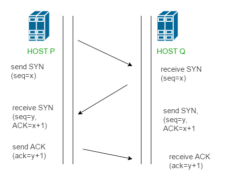

# Here we will go to upper layer which is Network Layer which is Layer three
- Network Layer is responsible for **routing and addressing** , It is the layer where the IP addresses are used

### Switch only understand MAC address that makes LIN but what if I want to connect different LIN
- So we need to convert MAC to IP address
- IP address is a 32 bit number that is divided into 4 octets, Each octet is separated by a dot
- IP address is used to identify a device on a network and to route packets between devices on a network.

### What is Routing ?
- Routing is the process of forwarding packets between devices on a network
- Routing is done by the Network Layer based on the IP address of the destination device

## evp protocol
- EVp is a protocol that is used for communication between the CAN bus and the IP network
- EVp is used to convert CAN bus messages to IP packets and vice versa.

### What is time synicing 
- Time synchronizing is the process of synchronizing the time on multiple devices on a network
- Time synchronizing is important for many applications such as data logging and control systems.
- Time synchronizing is typically done using a protocol such as NTP (Network Time Protocol)
- NTP is a protocol that is used to synchronize the time on multiple devices on a network.
- NTP uses a hierarchical structure to synchronize the time on devices on a network.
- The root server is the top of the hierarchy and is synchronized with an external time source.

# PTP protocol precision type protocol which is used to sync between nodes and this used over Ethernet
- PTP is a protocol that is used for time synchronizing on a network
- PTP is used to synchronize the time on devices on a network with an accuracy of nanoseconds

------------------------------------------------------------------------------------------------
* So If SRC = IP and DEST = IP, How SRC call DEST without MAC Address
- This is where the Network Layer comes in
### ARP frame
- ARP is a protocol that is used to resolve IP addresses to MAC addresses, adn it's typically used when a device needs to send a packet to a **device on the same network**

------------------------------------------------------------------------------------------------
# Layer four which is Transport Layer
- Transport Layer is responsible for providing reliable data transfer between devices on a network
- Transport Layer is responsible for breaking up data into packets and reassembling them at the receiving end
- Transport Layer is also responsible for error checking and correction

### Before this Layer our farme consist of 
- So we have Ethernet, Frame Layer, Network Layer and Transport Layer
- At the end of Transport Layer we know what protocol will be used in Layer three
- This protocol is TCP or UDP

* UDP --> For communication between two applications
- UDP is a connectionless protocol and best-effort protocol
- UDP does not guarantee delivery of packets or order of packets
- UDP is typically used for applications that do not require guaranteed delivery or order of packets

### What is the meaning of connectionless protocol
- Connectionless protocol is a protocol that does not establish a connection between devices before sending data
- Connectionless protocol is typically used for applications that do not require guaranteed delivery or order of packets
- Connectionless protocol is typically used for applications such as DNS, DHCP, and TFTP

- UDP Header --> Source Port, Destination Port, Length, Checksum.
- UDP is a simple protocol and does not have many fields

* Source Port
- Source Port is the port number of the device that is sending the packet
* Port Numbers
- Port numbers are used to identify the application or service that is running on a device
- Port numbers are typically in the range of 0 to 65535
- Well-known port numbers are used for common applications such as HTTP (80), FTP (21),and SSH (22)
- Dynamic port numbers are used for applications that do not require a specific port number

### DHCP 
* If I have 16 available IP and we have 30 ECU in the car but we know that no more than 16 ECU will be available at a time, How will we handle it
- This is where DHCP comes in and used to dynamically assign IP addresses to devices on a network so it automatically assign IP addresses to devices on a network and assign IP addresses to devices
- DHCP is also used to manage IP addresses on a network and to prevent IP address conflicts

* So DHCP is a protocol that is used to dynamically assign IP addresses to devices on a network
- DHCP is used to automatically assign IP addresses to devices on a network and assign IP addresses to devices on a network for a specific period of time

- So Server here would be an ECU but has DHCP application
- Client here would be an ECU but has DHCP application
- DHCP Server would be the one that is responsible for assigning IP addresses to devices on a network
- DHCP Client would be the one that is requesting an IP address from the DHCP Server
- DHCP Lease would be the period of time that the IP address is assigned to the device
### DHCP should be over UDP becuase it requires both of them to have IP

------------------------------------------------------------------------------------------------
* TCP protocol
- TCP is a connection-oriented protocol and guarantees delivery of packets and order of packets
- TCP is typically used for applications that require guaranteed delivery and order of packets
- TCP is typically used for applications such as HTTP, FTP, and SSH
- TCP is a reliable protocol and ensures that data is delivered in the correct order
 
 - How TCP works 
 - TCP establishes a connection between devices before sending data
 - TCP uses a three-way handshake to establish a connection
 - TCP uses a sequence number to ensure that data is delivered in the correct order
 - TCP uses an acknowledgement number to ensure that data is delivered correctly
 - TCP uses a window size to control the amount of data that is sent at one time
 - TCP uses a timeout to determine when a packet has not been delivered
 

* Three way handshake connection
- SYN (synchronize) packet is sent from the client to the server
- SYN-ACK (synchronize-acknowledgement) packet is sent from the server to the
- ACK (acknowledgement) packet is sent from the client to the server

- Sync flag
What is Sync flag
- The SYN flag is used to establish a connection between devices, synchronize the sequence numbers of the devices, and initiate the three-way handshake

- Acknowledgment flag
- PSH flag
- RST flag
- URG flag
- ECE flag
- CWR flag
- NS flag

-------------------------------------------------------------------------------------------------
DHCP sequence 
- DHCP(Client) sends DISCOVER then DHCP(Server) r OFFER

# What is Difference between Router and switch?
The key difference between a router and a switch lies in their roles and the layers at which they operate within a network.
Router:
- Purpose: Routers are used to connect different networks together and route traffic between them. They determine the best path for data packets to travel across interconnected networks (such as between a local network and the internet).
- Layer: Operates at Layer 3 (Network Layer) of the OSI model.
- Function: Routes data packets between networks based on IP addresses. Routers maintain a routing table to forward packets to the appropriate destination network, often across multiple paths.
- Use Case: A router connects a local network (e.g., a home or office network) to external networks such as the internet. It typically acts as a gateway for communication between different networks.
* Example: In a home network, the router connects to your ISP’s network (internet) and routes traffic between your home devices and the internet. It also provides NAT (Network Address Translation) to allow multiple devices to share a single public IP.

Switch:
Purpose: Switches are used to connect devices within the same network and manage the flow of data between them. They help efficiently direct traffic between devices on the local network.
- Layer: Operates at Layer 2 (Data Link Layer) of the OSI model, although some switches can operate at Layer 3 (these are called Layer 3 switches and can perform some routing functions).
- Function: Forwards data frames based on MAC addresses. A switch learns the MAC addresses of devices connected to each of its ports and forwards data only to the port where the destination device resides. This helps reduce unnecessary traffic within a local network.
- Use Case: A switch is typically used within a local area network (LAN) to connect computers, printers, servers, and other devices.
- Example: In an office network, a switch connects all computers and printers together. If one computer wants to send data to another computer, the switch will direct the data only to the destination device rather than broadcasting it to all devices.

# Why do they use IP meanwhile we can use MAC address, why do they defined IP in layer 3 
- The reason for using IP addresses (Layer 3) alongside MAC addresses (Layer 2) comes down to the distinct roles they play in network communication, scalability, and routing between networks. Here's why both IP addresses and MAC addresses are necessary and why IP is defined at Layer 3

1. Scope & Hirarchey 
- MAC Address (Layer 2): A MAC (Media Access Control) address is a unique identifier assigned to a network interface card (NIC) at the factory. It is used to identify devices on a local network. MAC addresses are flat and globally unique but have no hierarchical structure.
- IP Address (Layer 3): An IP (Internet Protocol) address is a logical, hierarchical address that is assigned to a device when it connects to a network. IP addresses are designed to enable routing across multiple, interconnected networks, such as the internet. They have a hierarchical structure (e.g., network part + host part) that helps route packets efficiently across different networks.

2. Routing Across Networks:
- MAC Addresses are used to communicate within the same local network (e.g., within the same Ethernet network). MAC addresses are not recognized beyond the local network segment because switches use them only to forward frames at Layer 2.
- IP Addresses, on the other hand, are used to route packets between different networks. Routers use IP addresses to determine the best path to forward packets to the destination network, which could be far beyond the local network. Without IP addresses, it would be impossible to route data across the internet or between different networks.

### Why IP is Defined in Layer 3 (Network Layer):

    Layered Model: The OSI Model and TCP/IP Model are designed to divide complex networking tasks into distinct layers. Each layer has specific responsibilities and interacts with the layers directly above and below it. IP addresses are defined in Layer 3 (Network Layer) because this layer is responsible for moving data packets from one network to another.

        Layer 2 (Data Link Layer): This layer deals with the delivery of data within a single network segment. It uses MAC addresses to identify devices and ensures that frames are delivered correctly between devices on the same local network.

        Layer 3 (Network Layer): This layer is responsible for end-to-end communication between devices on different networks. It uses IP addresses to route packets across networks and deliver them to the correct destination device.

        Reason: The Network Layer (Layer 3) is responsible for routing and addressing beyond the local network, which requires a system like IP addresses to manage communication between different networks.

Summary of Roles:

    MAC Addresses (Layer 2): Used for communication within a local network. They are static, hardware-based addresses that allow devices within the same broadcast domain to communicate.
    IP Addresses (Layer 3): Used for communication between different networks. They are logical, hierarchical addresses that enable routing and ensure that data can travel across vast, interconnected networks.

Why Not Use MAC Addresses Alone?

    Limited to Local Networks: MAC addresses cannot be routed between networks, which means they cannot facilitate communication on the internet or between geographically separated networks.
    No Hierarchy: MAC addresses lack a hierarchical structure needed for routing, making them unsuitable for efficiently managing large, complex networks.
    Routing and Scalability: The hierarchical nature of IP addresses allows routers to efficiently forward packets across multiple networks, ensuring global scalability.

In short, IP addresses are necessary because they allow devices to communicate beyond their local networks and enable efficient routing across the internet. MAC addresses, while important for local communication, are not sufficient for large-scale, inter-network communication.