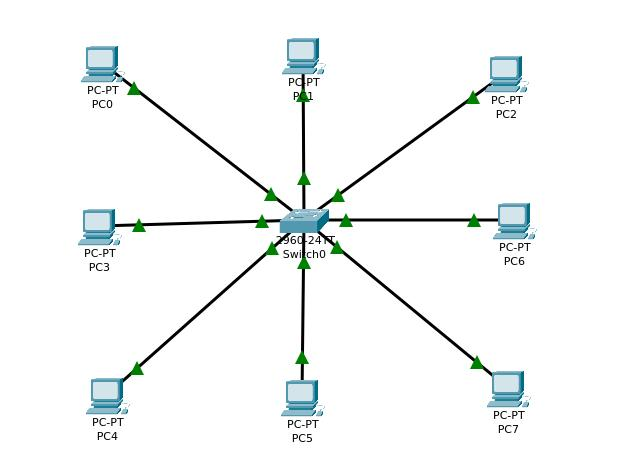

# Current Network Architecture in Automotive

- Ethernet Protocol in the Market

### OSI Architecture (Open Systems Interconnection)
- The OSI model is a conceptual framework that helps us understand and design network protocols and communication systems. It breaks down the complex process of network communication into seven distinct layers, each with its own specific role.

1. Physical Layer --> Define How data will transmit through wires/wirless(WIFI)

2. Data Link Layer --> his layer determines how data is formatted for transmission across the network. It handles the packaging of data into frames and manages error detection and correction. For instance, while the Physical Layer transmits raw bits, the Data Link Layer ensures that the data, such as the value 0xAA, is properly framed and formatted according to standardized protocols before sending it over the network.

ex:CAN - LIN - Ethernet --> Data - Physical layer 
- Till now we didn't go to internet so if we want we need to used Network
- Frame = Ethernet with physical Layer
3. Network --> Concept of connecting multiple network together to connect them together [IP-4,IP-6] --> This Layer is over Datalink Layer.
- The Power of Ethernet that Any network protocol [IPv4,IPv6] can be over Ethernet
* Frame = Ethernet + IPv4
4. Transport --> [TCP - UDP]
* Frame = Ethernet + IPv4 + TCP
5. Session

6. Presentation 

7. Application --> HTTP , FTP, DNS,....

كل layer بتستخدم اللى تحتها لحد  ما نوصل للفيزيكال

- So to call google.com --> (https) go and call TCP then (TCP) call IPv4, so (IPv4) call (Ethernet). 
- MAC Address is unique for my Device

|                     |      |            |              |            |
|   Ethernet Protocol | IPv4 | UDP header | https header | https data |
|                     |      |            |              |            |

                      |         This is the Payload of Ethernet       |
                      -------------------------------------------------
                             | This is the Payload of IPv4            |
                             ------------------------------------------

- This is the essential Layers and main layout of the protocol.
- Ethernet Gives capability to send 1500 byte , Speed = 200G. 
- Why ethernet wasn't used in Automotive years ago?
--> Broad-R Reach --> Just two wires connected between 2 nodes can be full duplex, So ethernet of Automtive just 2 wires and that's the reason Ethernet of existance of Ethernet in Automotive industry.

- Ethernet of Laptop is the same in Automotive but the difference between them is Physical layer but they are similar in data link layer -Let it to be similar not but in general they are not so Similar there is some difference between them based on Standered due to Hardware but still data frame are the same- [شكل ال فريم] and so on. 

------------------------------------------------------------------------------------------------

### TCP/IP Architecture

1. Link Layer --> THis Layer Group to layers of OSI in on layer which are Data and Physical

2. Internet --> Network

3. Transport

4. Application

------------------------------------------------------------------------------------------------

### Let's Start with Physical layer in Depth

- Ethernet is peer to peer, Full Duplex, Just 2 Nodes connected to each other

- We have 2 Mc such as RPI microcontroler So in our Phyical layer ther are some components:
1. Ethernet Caple    
2. Phy --> Which is the Socket that I enter Ethernet capble in. such as RG405
3. MAC peripheral that are connected to the PHy
                  -------
                -|       |-
- Phy --->      -|  PHy  |-  So The right side of PHY is MDI (Media Dependant interface)
                -|       |-     The  Left side is MII (Media Independant interface)
                  -------
- So PHY of thype RG405 Can only talk with RG405 aslo through MDI, or it can talk with another type by using converter in between.
- MAC talks with PHY through MII.

- PHY has Layers:
1. PCS --> Physical coding sublayer and it's responsible of coding and decoding of data such as (3B2), It's in side of MAC
2. PMA --> Physical Meduim Attachment, It's responsible of Identifying the data that I received.
            So it cancel the echo so we said that we can **send and receive at same time** at the same two wires, By recieving the full package of data the I sent and received then I cancel from this data, the one I have sent --> That's How I know the what's the received data
- So to connect both PHY should be up and it's happen when connecting tw PHYs nby Ethernet Caple, a checking mechanism happens and it's HW mechanism called link training.

------------------------------------------------------------------------------------------------

### Data Link Layer

- Data Link Layer is responsible of Framing, Error detection and correction, Flow control and Access control
- It's divided into two sub layers:
1. LLC (Logical Link Control)
2. MAC (Media Access Control)
- LLC is responsible of Framing and Error detection and correction
- MAC is responsible of Flow control and Access control
- MAC is responsible of Framing and Error detection and correction
- MAC is responsible of Flow control and Access control

-------------------------------------------
# Ethernet is node to node 
-------------------------------------------
- So in Ethernet we have 2 MACs, one in each node

- Ethernet untagged frame
- Ethernet tagged frame

- Ethernet tagged frame is used in VLAN (Virtual LAN)
- VLAN is used to divide the network into multiple virtual network

- What is the frame of both ?
  1.  Ethernet untagged frame
    - Destination MAC
    - Source MAC
    - Ethertype (2-Byte)
    - Payload

  2. Ethernet tagged frame
    - Destination MAC
    - Source MAC
    - VLAN tag (4-byte)
    - Ethertype (2-byte)
    - Payload

# What is the device that solve this limitation?
- Ethernet Switch
  - It's a device that connect multiple nodes together, a bridge between multiple nodes
  - It's a device that solve the limitation of Ethernet being node to node

- VLAN 
  - It's a way to divide a network into multiple virtual networks, it isolates traffic between different virtual networks and improve network security ,and performence

- VLAN + Ethernet switch

- What is TCAM --> It's a type of memory that is used in Ethernet switches, it's Filtering types of protocols so if we have anything of IPv4 I tell specific node to drop it.

- What is the difference between Router and Switch?
  - Router is a device that connect multiple networks together
  - Switch is a device that connect multiple nodes together

### How switch when receives a message, How does switch now destination MAC?
- Switch has a table called CAM (Content Addressable Memory)
- CAM is a table that contains the MAC address of each node connected to the switch
- When switch receives a message, it checks the destination MAC address in the CAM table

What if the CAM table is empty?
- Switch will flood the message to all nodes connected to it This is called broadcast and wait for MAC address owner to respond then add in the table MAC address and it's port then send directly.
- Broadcast is a type of message that is sent to all nodes connected to a switch
- Broadcast is used to discover the MAC address of a node and used to discover the IP address of a node

### Switch Autolearn feature
- Autolearn is a feature that allows a switch to learn the MAC address of a node automatically

or 

### predefine Manually in CAM table
- CAM table can be predefine manually by the network administrator
- This is called static CAM table

- Unicast : Unicast is a type of message that is sent to a single node
- Broadcast : Broadcast is a type of message that is sent to all nodes connected to a switch
- Multicast : Multicast is a type of message that is sent to a group of nodes
- Anycast

* Multicast one to n  
* Unicast --> one to one
* Broadcast --> one to all

### What is the difference between Multicast and VLAN tagged frame?
- Multicast is a type of message that is sent to a group of nodes and it's untagged frame and predefined inside the switch that if this MAC address sent is the SRC so send it to multiple nodes
- Tagged frame is a type of frame that is used in VLAN to identify the VLAN ID, allow multiple VLANs to be transmitted over a single link, and improve network security and performance

## nested switches
- Nested switches are switches that are connected to each other
- Nested switches are used to improve network security and performance
- Nested switches are used to connect multiple networks together

* Time Syncing, such as PTP (Precision Time Protocol) used for synchronising
