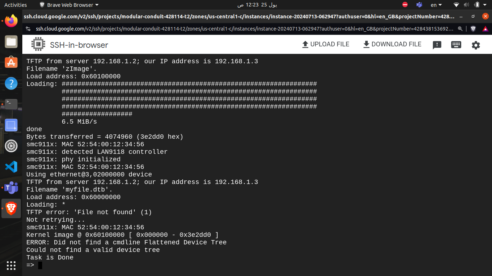

# Task 3 --> Booting from TFTB
### What have we done so far!?
- Let's first summarize what we have done to make our image run properly without a customization tool. We first created our cross-compiler using the tool Crosstool-NG, and then we created our target bootloader, which was U-Boot.
- Now after cloning our kernel and having zImage we want to boot using our kernel Image through TFTP (Trivial File Transfer Protocol)
- using same script

- booting from TFTb 

# kernel Panic

