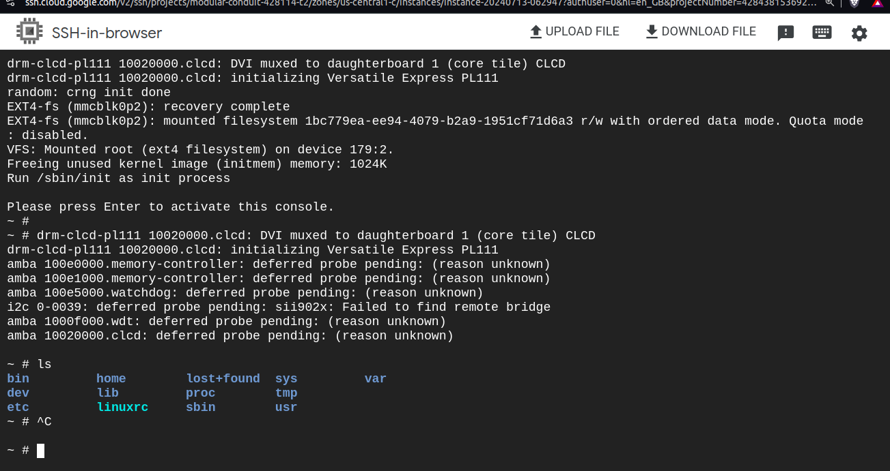

# Booting on Root files system from Sd Card
### what have we done so far!! 
- Let's first summarize what we have done to make our image run properly without using a customization tool. 
- We started by creating our cross-compiler using the Crosstool-NG tool. Next, we created our target bootloader, which is U-Boot. 
- We then created our target kernel image, which the bootloader will load either via SD card flash memory or through a network communication protocol, such as TFTP. 
- Now, we have the kernel image and the bootloader, but we are missing one crucial component: the root filesystem (rootfs). We will use sd Card to boot into Ramfile system.
------------------------------------------------------------------------------------------------
### Task
1. BOOT INTO RAMFS
2. mount devtmpfs , procfs ,sysfs
3. launch a script by init process (/sbin/init) that ask user which rootfile system you want to changeroot to it
4. once user choose script gonna mount the partition we choosed and change root into it
-----------------------------------------------------------------------------------------------
1. Enter rootfs on your Host
```bash 
cd ~/rootfs
```
2. Setup Rootfile system hirarchy
``` bash 
mkdir   dev  etc  home  lib  proc  sys  tmp  var
mkdir ./etc/init.d
```
3. Create inside init.d Rcs file which will run a shell script, rcS, when init is started , which will be called by the init program, this init program reads the the configuration file, /etc/inittab. Inside this file first command ::sysinit:/etc/init.d/rcS.
``` bash
touch rcS
sudo vim rcS
#!/bin/sh

mount -t proc proc /proc
mount -t sysfs sysfs /sys
mount -t devtmpfs devtmpfs /dev

chmod +x rcS
```
4. Copy content of _install to rootfile system
``` bash 
rsync -av ~/busybox/_install/* ~/rootfs
```


5. Now let's create the inittab file which will be read by the init program

``` bash
sudo vim ./etc/inittab
```
### Here is File system after stageing 


6. Now let's exam the permission 
``` bash 
ls -lh ~/rootfs
```
7. Change owner of file
``` bash 
sudo chown -R root:root ~/rootfs
```
8. Let's repeat assiging loops to sd card

### OK! If you followed my steps you will find a surprise!!!
- After mounting rootfs everything will be lost so, We shouldn't do that, we should do it on a host file then create rootfs which will be mounted

### Repeat all steps again
9. Now Let's move zImage and dtb to boot 

# Let's run Qemu

``` bash 
fatload mmc 0:1 ${kernel_addr_r} zImage
fatload mmc 0:1 ${fdt_addr_r} vexpress-v2p-ca9.dtb 
edit: console=tty0 console=ttyAMA0,38400n8 root=/dev/mmcblk0p2 rootfstype=ext4 rw  rootwait init=/sbin/init 
bootz ${kernel_addr_r} - ${fdt_addr_r} 
```


