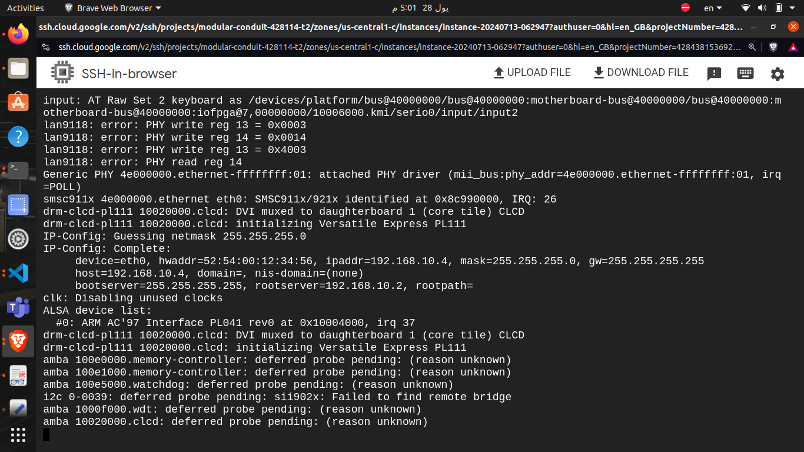

# NFS booting
- First we need to install NFS in our host
``` bash
sudo apt install nfs-kernel-server
```
- NFSD server needs to be told which directories are being exported to the network and this is controlled by /etc/exports.
- So we create Rootfs directory and put in it system file hierarchy
- Now we go and vim on /etc/exports
``` bash 
sudo vim /etc/exports
/srv/rootfs *(rw,sync,no_subtree_check,no_root_squash)
```

• rw : This exports the directory as read-write.
• sync : This option selects the synchronous version of the NFS protocol, which is
more robust but a little slower than the async option.Mounting the root filesystem using NFS
155
• no_subtree_check : This option disables subtree checking, which has mild
security implications, but can improve reliability in some circumstances.
• no_root_squash : This option allows requests from user ID 0 to be processed
without squashing to a different user ID. It is necessary to allow the target to
correctly access the files owned by root .

- Add tap0 as new interface

- Open Qemu to assign ipaddr and server address 

- edit bootargs
``` bash
editenv bootargs " console=tty0 console=ttyAMA0,38400n8 root=/dev/nfs rw nfsroot=<host-ip>:<root-dir> ip=<target-ip> 
```
- Then we bootz by kernel and dft address

