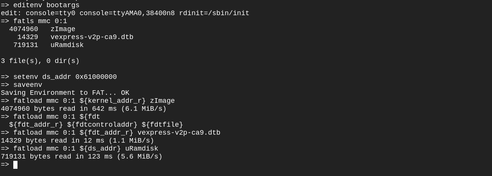

# Initramfs task Description
- We have initramfs image running above 2 rootfs and the kernel will firstly load the initramfs Which has a script doing a boot manager job
- The script is gonna ask the user which rootfs to be loaded 1 or 2
- If the user choose 1 then rootfs1 will be loadded
- If the user choose 2 then rootfs2 will be loaded

### Let's Create the archive , compress it ,and adds a U-boot header
- Get cpio file 
- This command finds all files and directories starting from the current directory, then creates a cpio archive in newc format of these files, sets their ownership to root:root, and saves the archive as initramsfs.cpio in the parent directory
``` bash 
find . | cpio -H newc -ov --owner root:root > ../initramsfs.cpio
```
- It will be created at parent directory 
- Now compress it to gzip 
``` bash
$ gzip initramfs.cpio
$ mkimage -A arm -O linux -T ramdisk -d initramfs.cpio.gz
uRamdisk
```
- Now move it to Boot partation

### Go and Open Qemu
- laod uRamdisk in 0x61000000 address 

- editenv the bootargs and append rdinit=/sbin/init
- bootz kernel, uRamdisk, fdt address 
