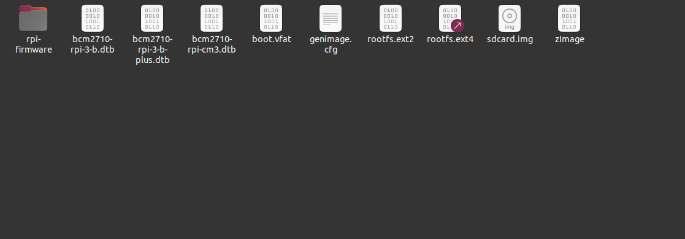
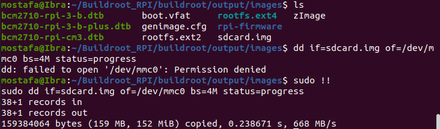
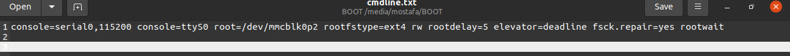
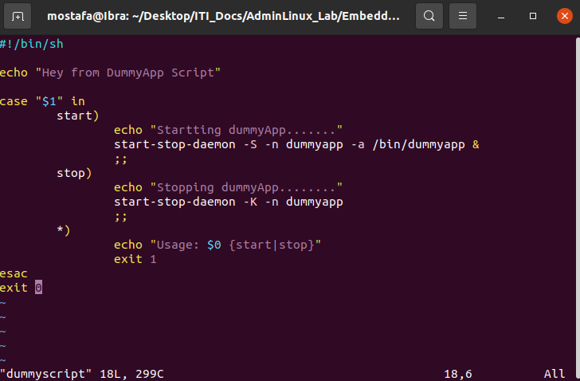
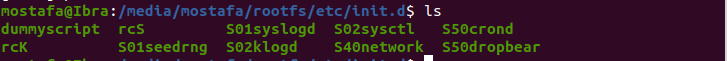
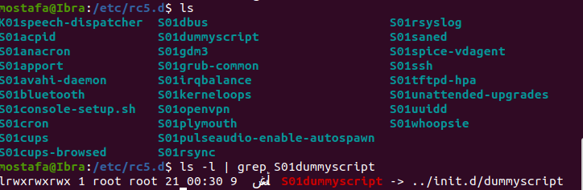
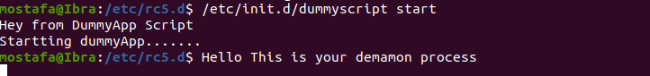

# System V Customization on Raspberry pi using buildroot

- After Cloning Buildroot repo, Configuring it, and building it. We now have sdcard.img


1. Attach Your Raspberry Sd Card and run this command to overwrite the contents of /dev/mmc0 with the image file,you will find two partitions making it suitable for use with a Raspberry Pi 3 B+.

``` bash 
dd if=sdcard.img of=/dev/mmc0 bs=4M status=progress
```


- You will find your cmdline.txt-The input to your kernel- already configured with rootfile system type and from where to root.

- In config.txt enable_uart=1 device_tree=bcm2710-rpi-3-b-plus.dtb

2. Before attaching your sd Card to RPI, Let's execute solve our task

3. Write Create a dummy.c and Get binary and make it executable


4. Move the binary to bin directory in rootfs 


5. Write script that will invoke the binary of dummyapp


6. Move it under /etc/init.b


7. Go to inside rc5.d and create softlink to the application
``` bash
$ cd /etc/rc5.d
$ sudo ln -s ../init.d/dummyscript S01dummyscript
```


8. Test the application


# Now attach your sd card, connect usb-ttl, open picocom


