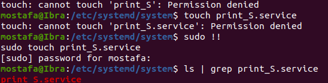
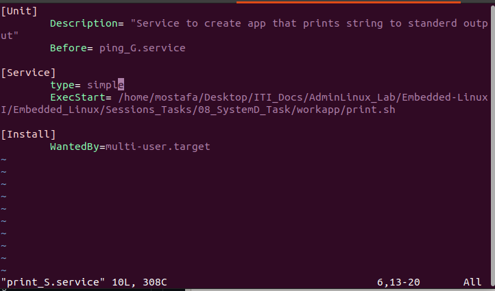
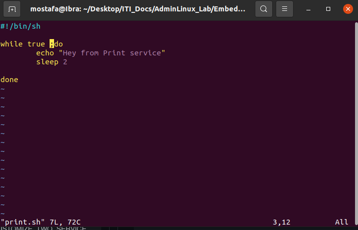
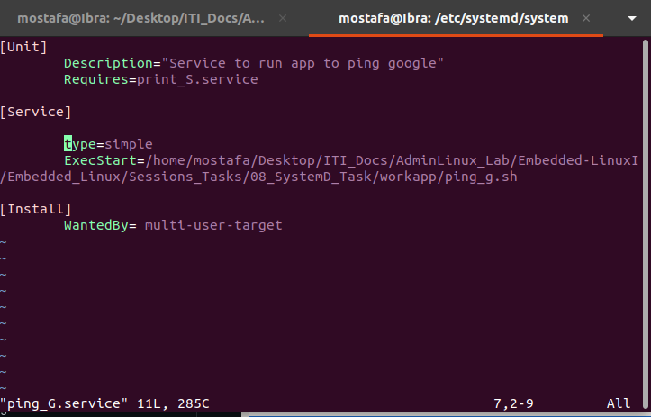
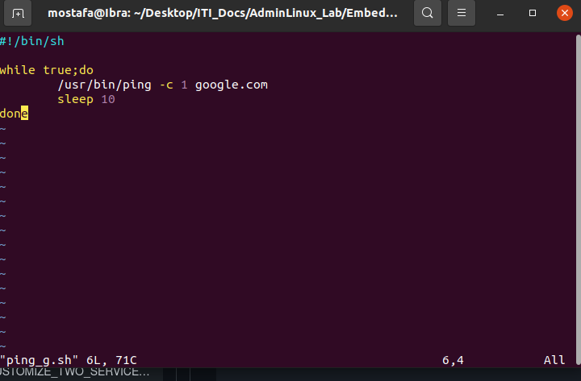
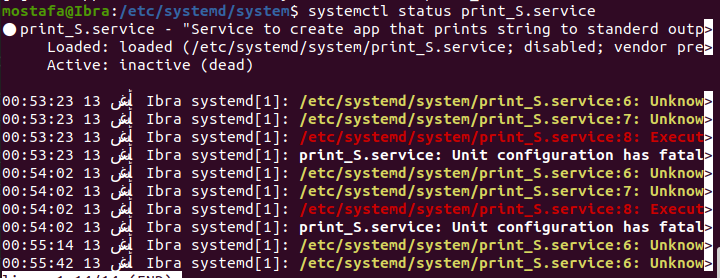
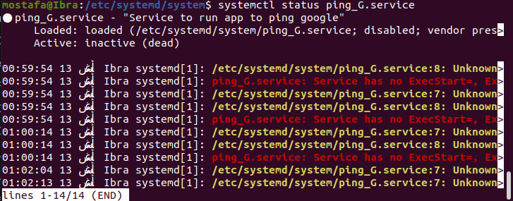
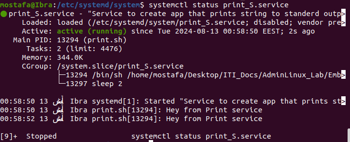
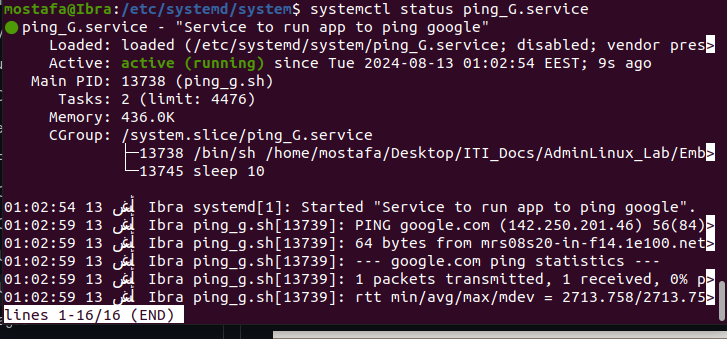

# Task Description
Create two services: the first service should print a string to the standard output, and the second service should ping Google. The second service must be dependent on the first service, meaning it should only start after the first service is running. Let's determine how to implement this dependency.
### Step 1: Define the first service
- Create service under etc/systemd/system directory

- Write your service named print_S.service

- Write the runnable script


### Step2: Define the second service

-Write runnable script


- Make both scripts executable

------------------------------------------------------------------------------------------------

- Reload daemon services 
```
sysetmctl daemon_reload
```
- Run systemctl status for both tasks



- Start both services by systemctl start 

