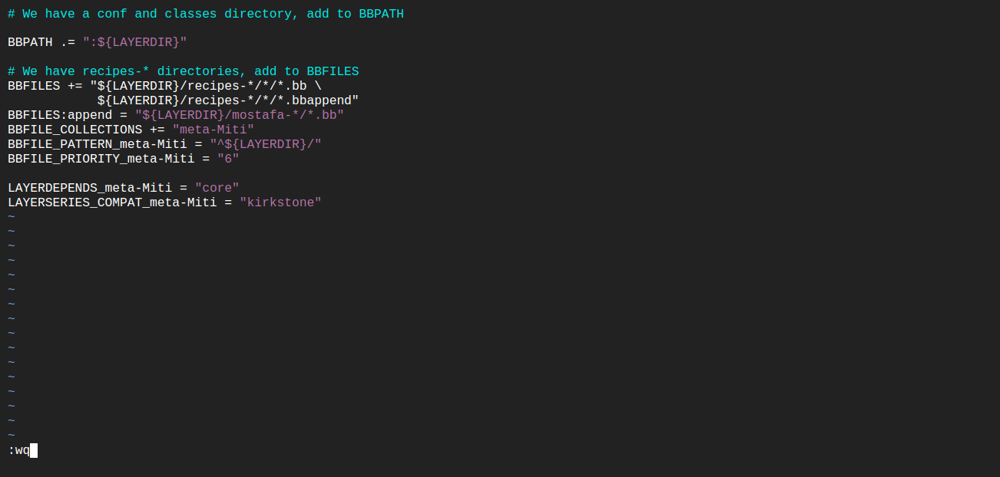
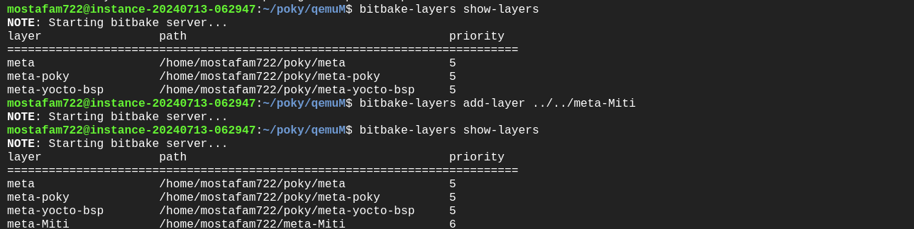

# Task Description
1. Create a build environment 
2. Create a new meta layer
3. Run a my own receipe and check on the displayed message based on Globale variable assignation

------------------------------------------------------------------------------------------------

### After Cloning poky and compiling it 

1. Create a build enviroment 
``` bash
$ source oe-init-build-env qemuM
```


2. Go to conf Directory and vim on local.conf and set variable
```bash
$ cd conf
$ vim local.conf
```


3. Create a new layer outside poky
```bash 
$ bitbake-layers create-layer ../meta-Miti
```
it will create a templete of meta layer


4. Create a new receipe directory 
```bash 
$ mkdir mostafa-recipe
$ cd mostafa-recipe
$ vim myrecipe_0.1.bb
```


5. Open layer.conf and append BBFile of Mostafa to see it
```bash
$ cd conf
$ vim layer.conf
```


6. Add the new layer to bitbake build path
```bash
$ bitbake-layers add-layer ../../meta-Miti
```


7. run the recipe 
```bash
$ bitbake myrecipe
```

