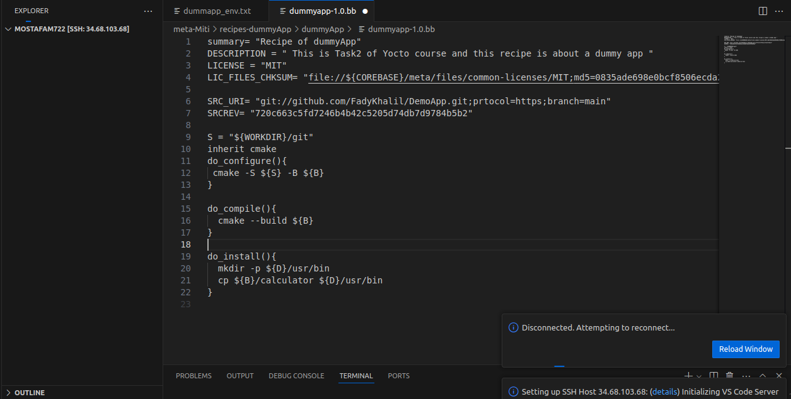

# How to create a recipe
- Recipe is a file with extenstion (.bb), it's the input file to bitbake which tells bitbake the required customization to generate the Image

- Recipe contains from:
1. Header Section: It has different local variables such as (SUMMARY - DESCRIPTION -..) but the most imprtant in this section is LICENSE variable --> If LICENSE = "Closed" --- > So we don't need to calculate CHKSUM
                     else --> We calculate CHKSUM by command md5sum 
ex: 
```
LICENSE= "MIT"
LIC_FILES_CHKSUM= "file://${COREBASE}/meta/files/open_license/MIT;md5=<Value of Calculation>"
```
2. Development Section: Here we will write local variables which are used in bitbake tasks

- Bitbake tasks:
1. do_fetch --> it's fetch from (Local,Github,Server), by reading variable SRC_URI
```
SRC_URI= <schema> -- Local  --> "file://main.c"
                     Server --> "http://<link>"
                     Github --> "git://<link{without http}>;protocol= https ; branch=main"
                     with Github we use:
                        SRCREV= "<Required commit number>" --> we must assign it with github
```
------------------------------------------------------------------------------------------------
# Task should write a recipe to fetch App from Github (Fady's repo) and compile it using Bitbake to generate App included in the Image.




