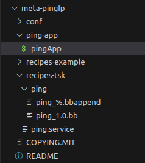
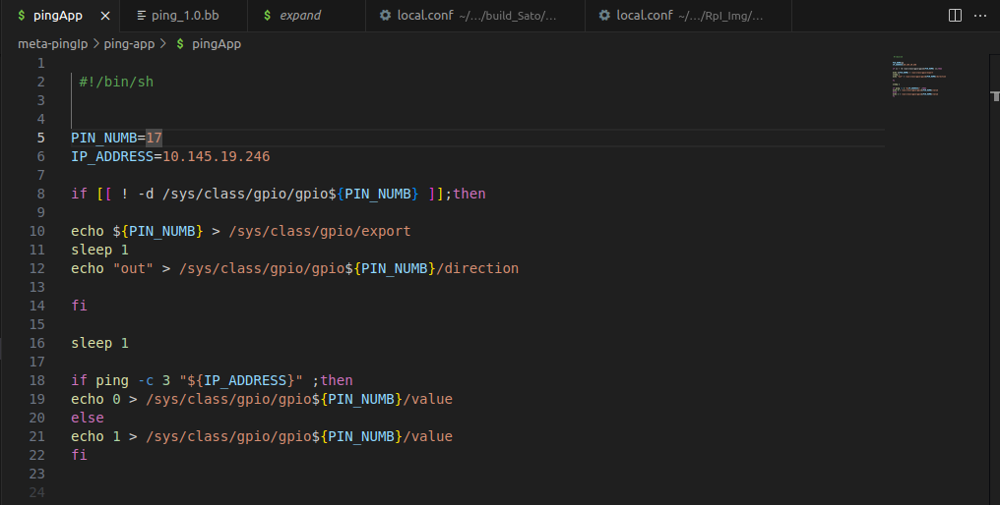
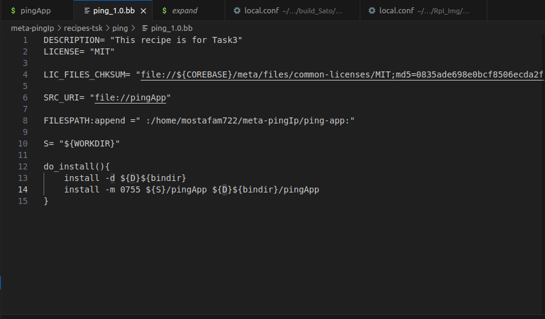
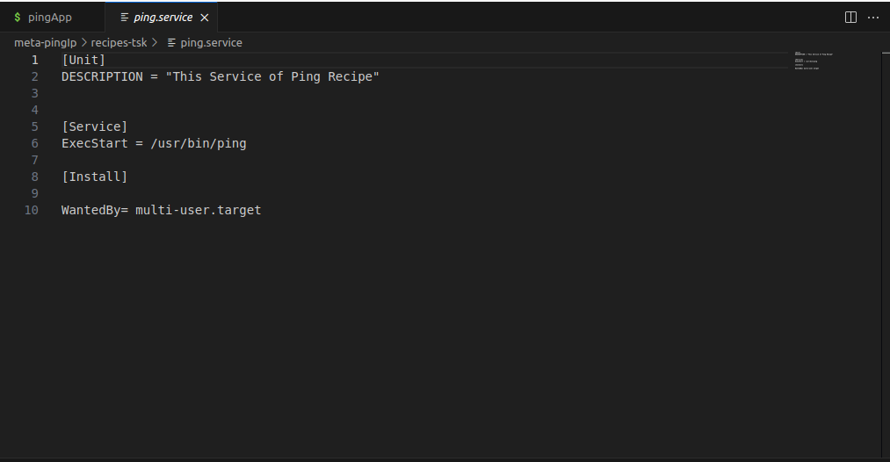
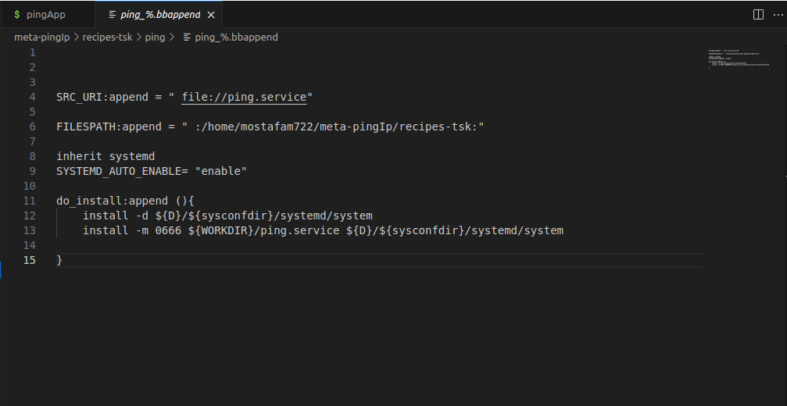
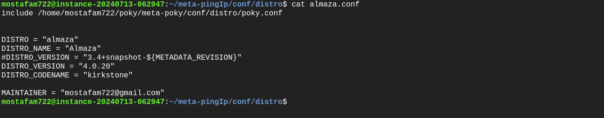

# Almaza Distro Creation & Running Ping Application on it using SystemD

### Previously we have created meta-pingIp and A recipe for a simple application, We als knew how to write it so let's jump directly to our new layer and Task

1. To create a layer --> bitbake-layers add-layer ../meta-PingIp

2. Create a dircetoy inside it and write Application that will ping pc ip and open Led if failed to ping it 

3. Create Ping App Recipe and ensure that the path of recipe is Right in layer.conf.

* Inside this Recipe -> SRC_URI variable was fetching locally so we wrote **file://pingApp**
* So to find it we need to **append App path to FILESPATH** so that bitbake enter read the path and find it -> **FILESPATH:append =" :/home/mostafam722/meta-pingIp/ping-app:"**

3. Create service file for this App to run it whenever Rpi starts
- To create it we need to work with systemd 
3.1) Write service file for this App.

3.2) Write a recipe and append it on the previous one for this Service ping_1.0.bbappend

3.3) To make Systemd work we need to Inherit systemd + SYSTEMD_AUTO_ENABLE= "enable" 
- SYSTEMD_AUTO_ENABLE= "enable" --> create Softlink to The target so that target will enable the service
3.4) We need to append SystemD package to the Image

4. Now we will create our Almaza Distro
4.1) First Change Distro variable in Local.conf --> DISTRO= "almaza"
4.2) In our layer under conf directory Create distro directory and create almaza.conf
4.3) In almaza.conf we will define our distro and append it to DISTRO

### Now bitbake ur Image