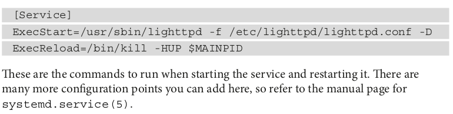

# Systemd 
- Chapter 13, Written based on Master Embedded Linux & ITI Session Notes

- Systemd defines itself as system service manager and it was to create an integrated set of tools for managing a Linux system based around an init daemon.

- So how is it better than System V init for Embedded Systems?
 1. Services are started in parallel --> Reducing boot time , SystemV is sequential.
 2. The configuration is simpler and more logical due to Unit Configuration files that are written in well defined-format. But SystemV was built based on scripts
 3. It can monitor Services and restert it if needed.
 4. The explicit dependencies between files rather than two digits in systemV 
 5. Better in security because it's easy to set the permissions and resource limits for each service.
 
- systemd Only uses glipc library since it does not support uClibc-ng or musl.

# Introducing to Targets, Services, and Units
- Unit: A Configuration file that describes a target, service, and several other things. It's a text file that contain properties and values. 

- Service: A daemon that can be started and stopped, very much like a System V init service.

- Target: Group of Services such as default target which is the group of services that are started at boot time. It's similar but more general than, a System V init runlevel.

### Units
- Units are found in three different files --> /etc/systemd/system/{Local, Runtime, Distribution-Wide Configuration}.

- all Units begins with Description which contain basic file information and dependencise.

- Units have Two types of dependencies which are Outgoing and Incoming:
 - Outgoing--> Is used to make dependencies between targets. List of targets need to be started as system goes from one state to another.
 - Incoming--> Create Links between services and tagets. This is made by WantedBy (Will be explained later)
 
• Before : Start this unit before the units listed.
• After : Start this unit after the units listed.
### Services 
- A service is a daemon that can be started and stopped, equivalent to a System V init service. A service is a type of unit file with a name ending in .service , for example, lighttpd.service .
- A service unit has a [Service] section that describes how it should be run.

### Taregts
- A target is another type of unit that groups service. It only has dependencies and ending with .target. It does the same role as systemV init runlevels.

# So How systemd boot !?
