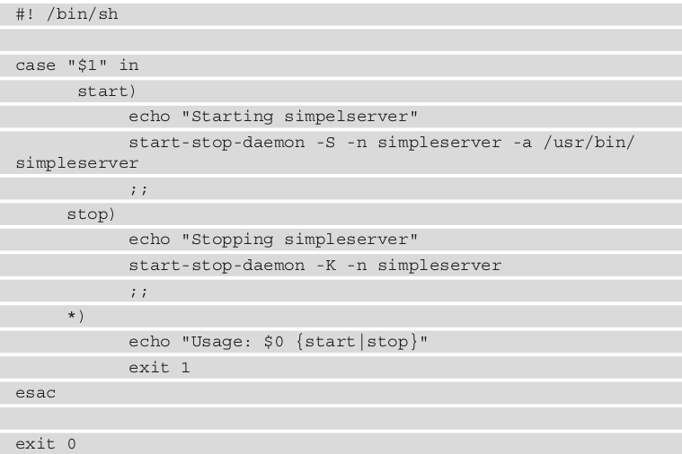

# Starting up - The init Program

## This is a summary of SystemV and this summary ws abstracted from the provided reference Link below

- So SystemV is an Init process such as the one in Busybox, And this init process is called by kernel as the first process to run after the kernel transfer control.
- SystemV init at the begenning call /sbin/init ----> this progrem parse the inittab file (such like busybox), At inittab file it executes the first action which is 
```bash 
::S::sysinit::rcS
```
- So inittab go and parse this file, mount directories, and call default run level -init 5-, Then it goes back to inittab and run rc.c file while having the specified run Level.

- rc.c is responsible of switching on runlevels -case 5- then enter the directory of rc5.d and loop over files inside this directory with S and k, and parse this files Symbolic linked to files inside init.d (ex: K01network --> k:kill , 01:priority,network:filename) (/etc/init.d network) , it abstracts k or s and execute it based on priority and go to filename to send k/S as argument.

- inside init.d there are our scripts which invoke the binary of any process that will start.

- SystemV is built on run levels.

- How to write script to run on specific run level?
1. Create app and compile it then put the binary inside /bin
2. inside init.d write your Script that will invoke the binary of the app
3. Go to the folder of the required run level and make symbolic link to all scripts inside init.d and make your app like it (S08dummyapp)


------------------------------------------------------------------------------------------------
### PS: This Notes are written from Master Embedded Linux book Chapter 13, it was my notes so it might not be organised well. I only made it for remembering.

- Previously with busybox we had to start all of our resources and put it in inittab because we have only one script. What if we divided our system into different run levels and in every level we start some processes and kill others.

- There are many possible implementations of init which are BusyBox init, System V init, Systemd

### After the kernel has booted 
1. the kernel bootstrap code seeks to find a root filesystem, either initramfs or a filesystem specified by root= on the kernel command line.

2. then executes a program that, by default, is /init for initramfs and /sbin/init for a regular filesystem --> ? (I don't know why he mentioned here that for initramfs is /init ad=nd for regular file system is /sbin/init, Meanwhile, at booth I used /sbin/init?)

### The init program 
- has root privilege, and since it is the first process to run, it has a process ID (PID) of 1 . If, for some reason, init cannot be started, the kernel will panic.
- The job of the init deamon to perform :
1. take control of the boot process in user space and set it running, During boot, after the kernel transfers control, the init program starts other daemon programs and configures system parameters and other things needed to get the system into a working state.
2. It adopts processes that become orphaned as a result of their immediate parent terminating and there being no other processes in the thread group.
3. It responds to any of the init's immediate children terminating by catching the SIGCHLD signal and collecting the return value to * prevent them from becoming zombie processes *.
4. It handles the system shutdown.

- In other words, init manages the life cycle of the system from bootup to shutdown.

### Buildroot init scripts
- Buildroot has two scripts in /etc/init.d/ named rcS and rcK .
- rcS --> The first one runs at bootup and iterates over all the scripts in /etc/init.d/ with names that begin with a capital (S) followed by two digits, and runs them in numerical order. (ex:S01)
- rcK --> run at shutdown and iterates over all the scripts beginning with a capital K followed by two digits and runs them in numerical order. These are kill scripts

- So it becomes easy for Buildroot packages to supply their own start and kill scripts, using the two-digit number to impose the order in which they should be run.

- Like BusyBox init , System V init relies on shell scripts inside /etc/init.d and an /etc/inittab configuration file. While the two init systems are similar in many ways, System V init has more features and a much longer history.

# System V init

- The BusyBox init deamon is just a trimmed-down version of System V init.Compared to busyBox, system V has two advantages:
1. It's easier to add new packages at runtime or buildtime due to the well known, modular format of the boot scripts.
2. It has the concept of the runlevels, which allows a collection of progrems to be started and stopped in one go when switching from one level to another. These modes will reduce CPU load on system.
- There are eight runlevels, numbered from 0 to 6 , plus S :
• S : Runs startup tasks
• 0 : Halts the system
• 1 to 5 : Available for general use --> 1. Single User , 2. Multi-User without Network, 3.Muli-User with Network, 4.Not Used, 5.Multi-User with Graphical login which we use it. 
• 6 : Reboots the system  

- The init program starts with default runlevel given in init default line in etc/inittab. You can change the level mode by telinit 5, This will change to run level 5

### How to switch between modes
- By using init n 
n: number of required mode

# Usage of system v in Embedded Linux
- We could have different run modes such as 
    - Application Mode
    - Maintenance Mode

### Runlevels
- Each runlevel has a number of scripts that stop things, called kill scripts, and another group that starts things, the start scripts.
- When entering new level --> init first runs kill scripts in the new level and then start scripts of it.
- the default action on the switching runlevel is to terminate daemons unless told to do otherwise.

- System V is used in both Buildroot and Yocto Project.

### Inittab
- The format is an extended version of the BusyBox 
    - id : runlevels : action : process

- The fields are shown here:
• id : A unique identifier of up to four characters.
• runlevels : The runlevels for which this entry should be executed. This was left blank in the BusyBox inittab .
• action : One of the keywords given in the following paragraph.
• process : The command to run.

- The actions are the same as for BusyBox init : sysinit , respawn , once , wait , restart , ctrlaltdel , and shutdown . However, System V init does not have askfirst , which is specific to BusyBox.

### The init.d scripts
- Each component that needs to respond to a runlevel change has a script in /etc/init.d to perform the change. The script should expect two parameters: start and stop.
- Let's have an example 
``` bash
cd /etc
ls | grep rc 
```
- There you will find a set of scripts beginning with a capital S followed by two digits, and you may also find scripts beginning with a capital K. which is kill scripts. These are in fact a symbolic link (Soft Link) back to the appropriate script in init.d.

### Add a new deamon
If I have a deamon script called Simple server such

- start-stop-daemon is a helper function that makes it easier to manipulate background processes such as this. It starts with S and close with k

- To make it operational--> 
1. Copy the script to the target directory /etc/init.d/simpleserver & make it executable
2. Add links from each of the runlevels that you want to run this program from; in this case, only the default runlevel of 5.
``` bash
# cd /etc/init.d/rcS.d
# ln -s ../init.d/simpleserver S99simpleserver
```

- System V init is a simple init daemon that has served Linux admins for decades. It still lack to ability of monitoring services and restert them if needed. Is it the reason of moving most popular distro to Systemd?

# Task
- Make a script that prints Hello and make it as a Service 

# Reference
- 

